*******************************************************************************************************
**How To Build Unified Medical Language System References for Use with The Health Management Platform**
*******************************************************************************************************

**A detailed guide, executed on an Apple machine**

**Requirements:**

* The latest version of HMP source-code

    * Zip downloadable from GitHub_

* Access to the National Library of Medicine's UMLS archives

    * 2012AB UMLS downloadable from NLM_

* Caché_

* Eclipse_

* Maven_

.. contents:: Quick Jump To...

.. Quick Jump To...
    Building the UMLS References
    Compiling and Running HMP

Building the UMLS References
****************************

.. contents:: Quick Jump To...

.. Quick Jump To...
    1) Launch MetamorphoSys
    2) Install UMLS
    3) Prepare a PostgreSQL Database to Receive the UMLS Subset
    4) Load the UMLS Subset into a Temporary Relational Database
    5) Use Eclipse and Maven to find HMP's Library
    6) Compile H2TermDataSource
    7) Run H2TermDataSource and Configure Data Files

1) Launch MetamorphoSys
=======================

* Configure the directory tree

    * Download and unzip the Health Management Platform

    * Download and unzip the ``2012AB_UMLS`` files

	* Move all files in the unzipped ``mmsys`` folder into the main
          directory and delete the ``mmsys`` folder

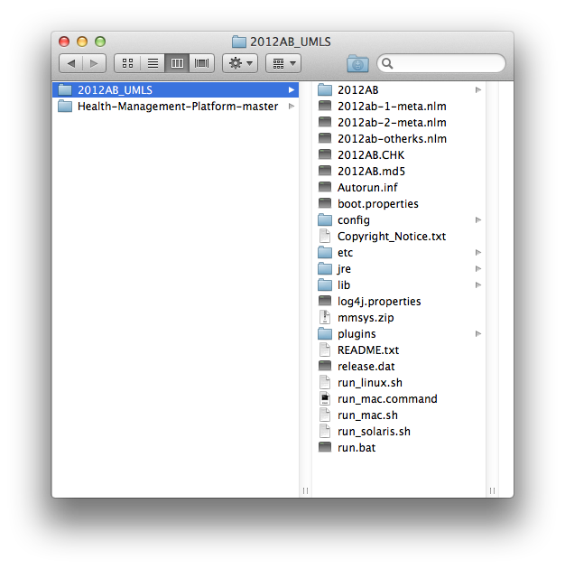

* Launch MetamorphoSys

    * In terminal, execute the following commands::

	cd 2012AB_UMLS/
	./run_mac.sh

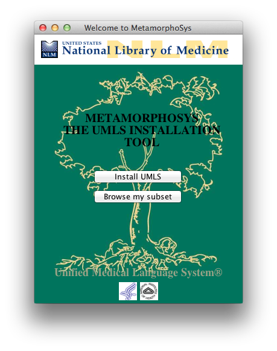

2) Install UMLS
===============

* Install UMLS

    * In MetamorphoSys, click on Install UMLS

    * Source and destination are 2012AB_UMLS

    * Select to only install Metathesaurus

    * Click OK

    * The Progress… window should pop up

* Create a new configuration

    * Choose a New Configuration…

    * Accept the License Agreement

    * Select a default subset (I chose Level 0 + SNOMEDCT)

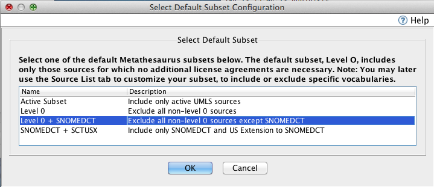

* Specify the UMLS Metathesaurus Configurations

    * The Input Options Tab should be fine

    * Uncheck Build and sort browser index files on the Output Options tab

    * Command+Click or Control+Click to select the following (and their
      related sources)::

	International Classification of Diseases, Ninth Revision
	LOINC, 240
	National Drug File, 2012_09-04
	RxNorm Vocabulary, 12AA_120904F
	SNOMED Clinical Terms, 2012_07_31
	Veterens Health Administration National Drug File, 2012_07_27

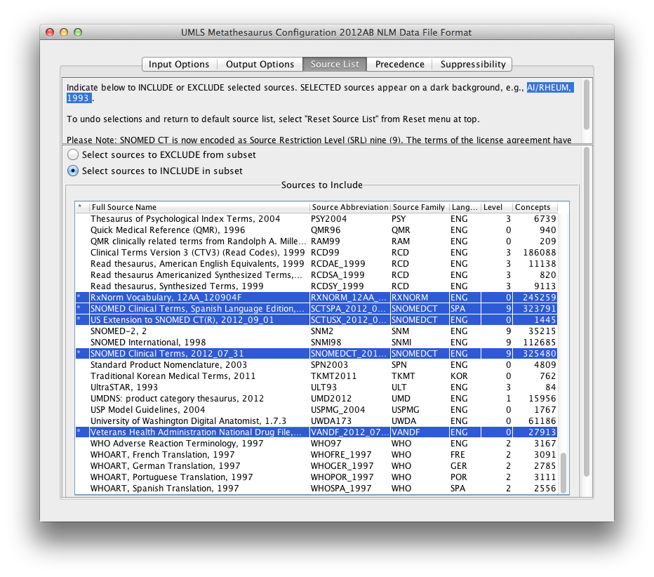

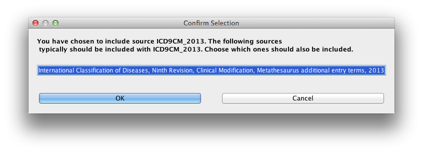

* Begin the subset

    * From the toolbar menu, select Done -> Begin Subset

    * My machine asked to save my changes to the configuration file (located at
      ``2012AB_UMLS/config/2012AB/umls.prop``)

    * The Progress… window will detail your status

    * This should take 30-60 minutes and will display a log when complete

.. image:: Images/FMMSYSprogress.png
    :align: center

.. image:: Images/StatusLog.png
    :align: center

3) Prepare a PostgreSQL Database to Receive the UMLS Subset
===========================================================

* Download, install and start PostgreSQL_ 9.1.11

    * If it asks for a password for user postgres be sure to make it ``postgres``
      and make note of the available port (the first should be 5432, mine was
      5434)

* Register a new server

    * Clear out all default servers

    * Go to File > Add Server… in the toolbar and create your server

	* The name of the server is ``PostgreSQL 9.1``

	* The host is 'localhost' on port ``5434`` (Use the default port but be
          sure to update future code if it's different than the default 5432)

	* The username and password are both ``postgres``

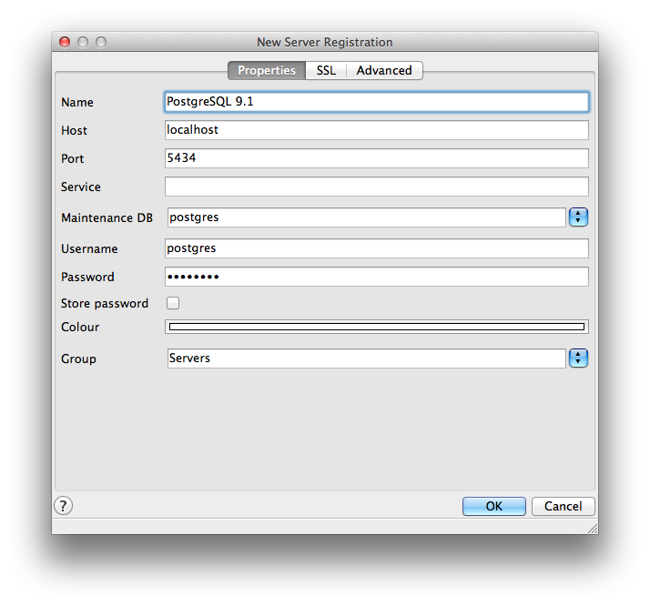

* Create a target directory for the data

    * I put mine in my ``2012AB_UMLS`` directory

    * In terminal, execute the following commands::

	cd 2012AB_UMLS/
	mkdir data

* Make the data directory accessible by PostgreSQL

    * In terminal, execute the following command::

	sudo chown postgres:daemon data

    * Enter your user password for your machine

* Set up your database shell

    * In PostgreSQL, click on the ``postgres`` database in the directory tree
      and the SQL button (the magnifying glass that says SQL) should be
      clickable

    * Enter the following SQL statement, be sure to replace the LOCATION with
      your target directory's location::

	CREATE ROLE umls2012ab LOGIN SUPERUSER UNENCRYPTED PASSWORD 'umls2012ab'  VALID UNTIL 'infinity';
	CREATE SCHEMA umls2012ab AUTHORIZATION umls2012ab;
	GRANT USAGE ON SCHEMA umls2012ab TO public;
	CREATE TABLESPACE umls2012ab OWNER umls2012ab LOCATION '/Path/To/HMP/2012AB_UMLS/data' ;
	SET ROLE umls2012ab;
	SET default_tablespace=umls2012ab;

    * Click the execute as a pgScript button (the green play symbol surrounded
      by P G S)

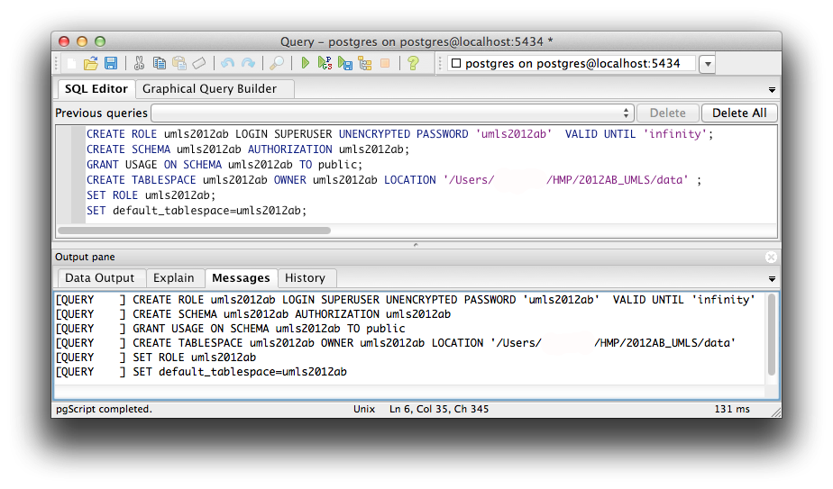

* Your database should now look like this:

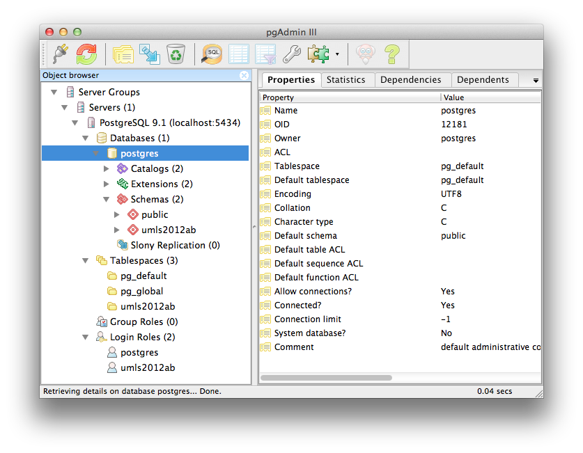

4) Load the UMLS Subset into a Temporary Relational Database
============================================================

* Download the PostgreSQL driver jar_

    * Create a new folder called ``lib`` inside ``umls-import-tools/``

    * Move the jar into the new folder

	* On my machine::

	    Health-Management-Platform/hmp/umls-import-tools/lib/postgresql-9.1-901.jdbc4.jar

* Update the ``UMLSLoader.sh`` file

    * File is located at::

	Health-Management-Platform/hmp/umls-import-tools/UMLSLoader.sh

    * If your port is anything other than 5434, update the port

    * Change all ``/path/to/`` to correct ``*.RRF`` file locations    		

    * You may need to make the file executable

	* In Terminal, navigate to the umls-import-tools directory then execute
          the following::

	    chmod +x UMLSLoader.sh

* Compile the java file called UMLSLoader

    * Create a new ``bin`` folder and compile ``UMLSLoader.java`` into it

	* In Terminal, execute the following commands::

	    cd Health-Management-Platform/hmp/umls-import-tools/
	    mkdir bin
	    javac -d bin src/main/java/UMLSLoader.java

* The directory should look like this at this point:

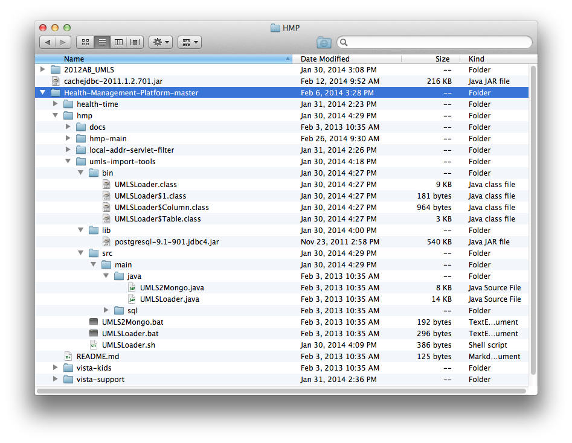

* Run the UMLSLoader.sh file

    * In Terminal, execute the following::

	cd Health-Management-Platform/hmp/umls-import-tools/
	./UMLSLoader.sh

    * If the command executes correctly terminal should display something like
      this for a few hours:

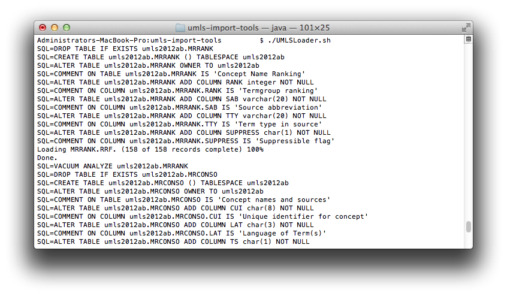

* Create one more necessary index in the PostgreSQL database

    * This query will take a few minutes::

	CREATE INDEX x_mrel_idx2 ON umls2012ab.mrrel USING btree
	(aui2 COLLATE pg_catalog."default" )
	TABLESPACE umls2012ab;

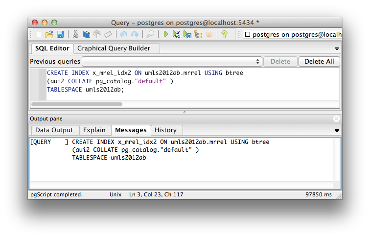

* If everything has been successful, your PostgreSQL database should look
  something like this

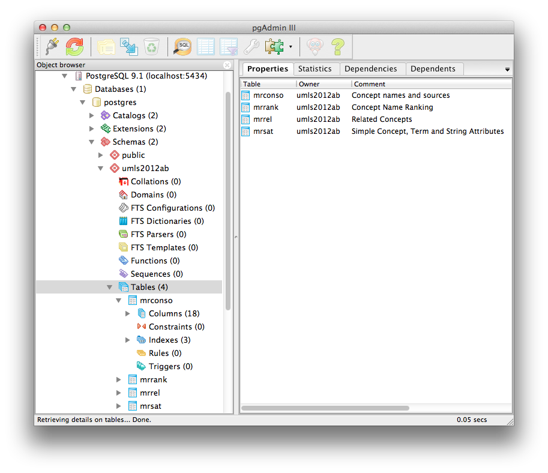

5) Use Eclipse and Maven to find HMP's Library
==============================================

* Find and install Caché jdbc driver into local maven repository

    * If Caché already exists on your system

	* You need to get the JDBC jar from a 2011.1.2.701 Caché install from::

	    ~/InterSystems/Cache/dev/java/lib/JDK16/cachejdbc.jar

	* In Terminal, execute the following::

	    cd ~/InterSystems/Cache/dev/java/lib/JDK16/
	    mvn install:install-file -Dfile=cachejdbc.jar -DgroupId=com.intersystems -DartifactId=cachejdbc -Dversion=2011.1.2.701 -Dpackaging=jar

    * If you have a standalone copy of the Caché JDBC jar

	* In Terminal, execute the following::

	    cd /path/to/cache/jar/
	    mvn install:install-file -Dfile=cachejdbc-2011.1.2.701.jar -DgroupId=com.intersystems -DartifactId=cachejdbc -Dversion=2011.1.2.701 -Dpackaging=jar

* Ensure that you have the Maven plugin for Eclipse

    * To check this in Eclipse, select Help->Eclipse Marketplace from the 
      toolbar dropdown

	* Click on the installed tab and look for the m2e plugin

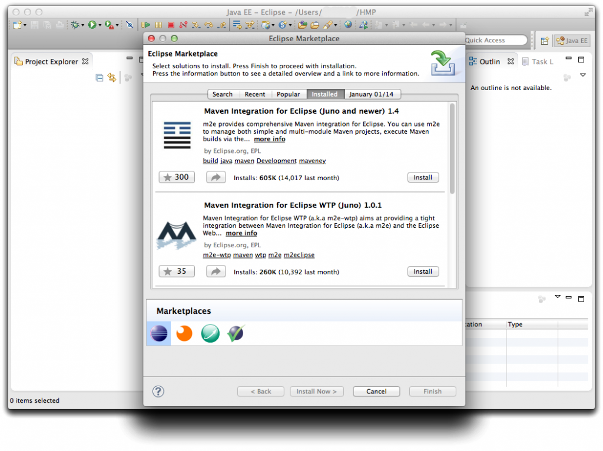

* Create a new Eclipse workspace

    * In Eclipse:

	* File > Switch Workplace > Other...

	* Mine is ~/HMP

	* Close out the welcome message and your blank workspace will appear

    * Turn off automatic builds

	* Project > Build Automatically

* Import HMP

    * File > Import

    * Choose Existing Maven Projects from the Maven drop down

    * Your root directory should be Health-Management-Platform

    * Maven will find the project's ``pom.xml`` files, click next		

    * There will be a few missing dependencies, these are the database files we
      are creating in this tutorial

	* Make sure these say Resolve Later

    * Click finish and choose to ignore the build errors

    * The project will be added to your workspace

    * Allow Maven a few minutes to find dependencies, there is a progress bar
      in the bottom right corner of Eclipse

* There should still be a few errors or warnings in the HMP directory 

    * Mine looks like this:

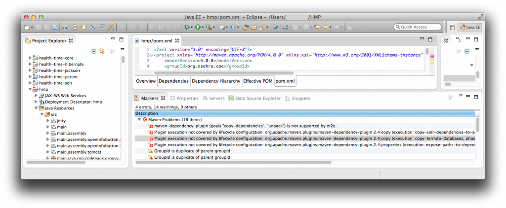

6) Compile H2TermDataSource
===========================

* Update H2TermDataSource.java

    * If your PostgreSQL localhost port is anything other than 5432, find and
      open the file called ``H2TermDataSource.java``

	* On my machine::

	    Health-Management-Platform/hmp/hmp-main/src/main/java/org/osehra/cpe/vpr/termeng/H2TermDataSource.java

    * In the Main method, update the PostgreSQL port

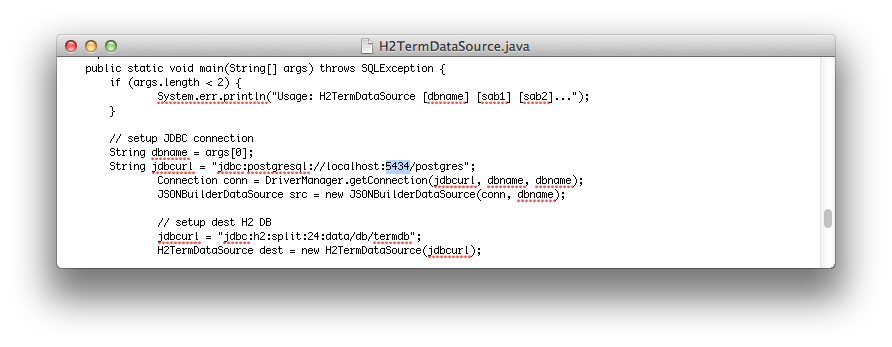

* Compile H2TermDataSource

    * In Terminal, execute the following commands::

	cd Health-Management-Platform-master/hmp/hmp-main/src/main/java

	javac org/osehra/cpe/vpr/web/IHealthCheck.java

	javac org/osehra/cpe/vpr/termeng/ITermDataSource.java

	javac org/osehra/cpe/vpr/termeng/AbstractTermDataSource.java

	javac org/osehra/cpe/vpr/vistasvc/ICacheMgr.java

	javac -cp .:/.m2/repository/net/sf/ehcache/ehcache-core/2.6.0/ehcache-core-2.6.0.jar:/.m2/repository/org/springframework/spring-web/3.1.2.RELEASE/spring-web-3.1.2.RELEASE.jar org/osehra/cpe/vpr/vistasvc/CacheMgr.java

	javac org/osehra/cpe/vpr/termeng/JSONBuilderDataSource.java

	javac -cp .:/.m2/repository/com/fasterxml/jackson/core/jackson-databind/2.0.6/jackson-databind-2.0.6.jar:/.m2/repository/net/sf/ehcache/ehcache-core/2.6.0/ehcache-core-2.6.0.jar:/.m2/repository/org/springframework/spring-web/3.1.2.RELEASE/spring-web-3.1.2.RELEASE.jar:/.m2/repository/com/fasterxml/jackson/core/jackson-core/2.0.6/jackson-core-2.0.6.jar org/osehra/cpe/vpr/termeng/H2TermDataSource.java

7) Run H2TermDataSource and Configure Data Files
================================================

* Be sure to reconnect to your PostgreSQL database

* Check your data drop folder and ensure it is empty

    * Located at::

	Health-Management-Platform/hmp/hmp-main/src/main/java/data/db

* Navigate to the ``java`` directory

    * In Terminal::

	cd Health-Management-Platform/hmp/hmp-main/src/main/java

**The following three commands can be executed in any order:**

* Generate the SNOMEDCT zip

    * Run the following command in Terminal (watch for embedded paths)::

	java -cp .:/.m2/repository/com/fasterxml/jackson/core/jackson-databind/2.0.6/jackson-databind-2.0.6.jar:/.m2/repository/net/sf/ehcache/ehcache-core/2.6.0/ehcache-core-2.6.0.jar:/.m2/repository/org/springframework/spring-web/3.1.2.RELEASE/spring-web-3.1.2.RELEASE.jar:/.m2/repository/com/fasterxml/jackson/core/jackson-core/2.0.6/jackson-core-2.0.6.jar:/.m2/repository/com/fasterxml/jackson/core/jackson-annotations/2.0.6/jackson-annotations-2.0.6.jar:/.m2/repository/postgresql/postgresql/9.1-901.jdbc4/postgresql-9.1-901.jdbc4.jar:/.m2/repository/org/slf4j/slf4j-api/1.5.8/slf4j-api-1.5.8.jar:/.m2/repository/org/slf4j/jcl-over-slf4j/1.5.8/jcl-over-slf4j-1.5.8.jar:/.m2/repository/org/slf4j/slf4j-nop/1.5.8/slf4j-nop-1.5.8.jar:/.m2/repository/org/springframework/spring-jdbc/3.1.2.RELEASE/spring-jdbc-3.1.2.RELEASE.jar:/.m2/repository/com/h2database/h2/1.3.167/h2-1.3.167.jar:Health-Management-Platform/hmp/hmp-main/src/main/resources/ org/osehra/cpe/vpr/termeng/H2TermDataSource umls2012ab SNOMEDCT

    * This will take 1-2 hours

    * Revisit your data drop folder

	* On my machine::

	    Health-Management-Platform/hmp/hmp-main/src/main/java/data/db

	* Compress all 79 termdb.* files into a zip file called ``SNOMEDCT.zip``

	* Delete all the termdb.* files but the new zip

* Generate the DRUGS zip

    * Run the following command in Terminal (watch for embedded paths)::

	java -cp .:/.m2/repository/com/fasterxml/jackson/core/jackson-databind/2.0.6/jackson-databind-2.0.6.jar:/.m2/repository/net/sf/ehcache/ehcache-core/2.6.0/ehcache-core-2.6.0.jar:/.m2/repository/org/springframework/spring-web/3.1.2.RELEASE/spring-web-3.1.2.RELEASE.jar:/.m2/repository/com/fasterxml/jackson/core/jackson-core/2.0.6/jackson-core-2.0.6.jar:/.m2/repository/com/fasterxml/jackson/core/jackson-annotations/2.0.6/jackson-annotations-2.0.6.jar:/.m2/repository/postgresql/postgresql/9.1-901.jdbc4/postgresql-9.1-901.jdbc4.jar:/.m2/repository/org/slf4j/slf4j-api/1.5.8/slf4j-api-1.5.8.jar:/.m2/repository/org/slf4j/jcl-over-slf4j/1.5.8/jcl-over-slf4j-1.5.8.jar:/.m2/repository/org/slf4j/slf4j-nop/1.5.8/slf4j-nop-1.5.8.jar:/.m2/repository/org/springframework/spring-jdbc/3.1.2.RELEASE/spring-jdbc-3.1.2.RELEASE.jar:/.m2/repository/com/h2database/h2/1.3.167/h2-1.3.167.jar:Health-Management-Platform/hmp/hmp-main/src/main/resources/ org/osehra/cpe/vpr/termeng/H2TermDataSource umls2012ab VANDF NDFRT RXNORM

    * This will take 30-45 minutes

    * Revisit your data drop folder

	* On my machine::

	    Health-Management-Platform/hmp/hmp-main/src/main/java/data/db

	* Compress all 47 termdb.* files into a zip file called ``DRUGS.zip``

	* Delete all the termdb.* files but the new zip

* Generate the LOINC zip

    * Run the following command in Terminal (watch for embedded paths)::

	java -cp .:/.m2/repository/com/fasterxml/jackson/core/jackson-databind/2.0.6/jackson-databind-2.0.6.jar:/.m2/repository/net/sf/ehcache/ehcache-core/2.6.0/ehcache-core-2.6.0.jar:/.m2/repository/org/springframework/spring-web/3.1.2.RELEASE/spring-web-3.1.2.RELEASE.jar:/.m2/repository/com/fasterxml/jackson/core/jackson-core/2.0.6/jackson-core-2.0.6.jar:/.m2/repository/com/fasterxml/jackson/core/jackson-annotations/2.0.6/jackson-annotations-2.0.6.jar:/.m2/repository/postgresql/postgresql/9.1-901.jdbc4/postgresql-9.1-901.jdbc4.jar:/.m2/repository/org/slf4j/slf4j-api/1.5.8/slf4j-api-1.5.8.jar:/.m2/repository/org/slf4j/jcl-over-slf4j/1.5.8/jcl-over-slf4j-1.5.8.jar:/.m2/repository/org/slf4j/slf4j-nop/1.5.8/slf4j-nop-1.5.8.jar:/.m2/repository/org/springframework/spring-jdbc/3.1.2.RELEASE/spring-jdbc-3.1.2.RELEASE.jar:/.m2/repository/com/h2database/h2/1.3.167/h2-1.3.167.jar:Health-Management-Platform/hmp/hmp-main/src/main/resources/ org/osehra/cpe/vpr/termeng/H2TermDataSource umls2012ab LNC

    * This will take 10-20 minutes

    * Revisit your data drop folder

	* On my machine::

	    Health-Management-Platform/hmp/hmp-main/src/main/java/data/db

	* Compress all 24 termdb.* files into a zip file called ``LOINC.zip``

	* Delete all the termdb.* files but the new zip

* The data directory should look like this when complete:

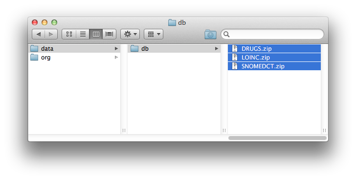

* Move the data directory into the ``hmp-main/`` directory, this makes
  referencing the zip files easier later on

    * Execute the following in Terminal::

	cd Health-Management-Platform/hmp/hmp-main/src/main/java
	mv data/ ../../../../hmp-main/ 

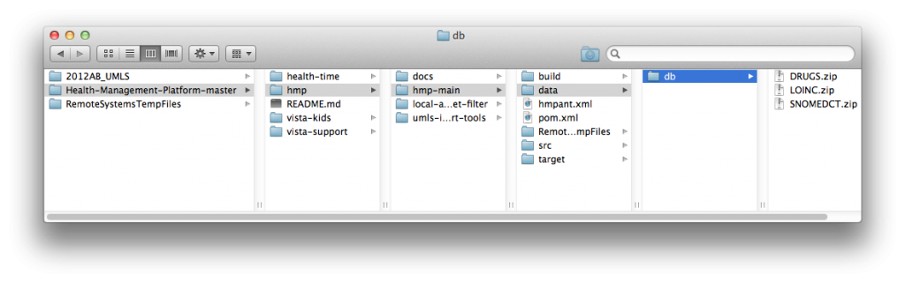

* You can now close your PostgreSQL connection

Compiling and Running HMP
*************************

.. contents:: Quick Jump To...

.. Quick Jump To...
    8) Configure HMP to Incorporate the UMLS Files
    9) Manually Update Maven Repository to Fill HMP Library
    10) Compile HMP
    11) Setting Up HMP
    12) Running HMP

8) Configure HMP to Incorporate the UMLS Files
==============================================

* Configure ``frame-config.xml``

    * Find and open ``frame-config.xml``

	* In finder::

	    Health-Management-Platform/hmp/hmp-main/src/main/webapp/WEB-INF/spring/frame-config.xml

	* In my Eclipse Project Explorer::

	    hmp/Deployed Resources/WEB-INF/spring/frame-config.xml

    * Find the termEng bean

	* Alter ``frame-config.xml`` to point to the 3 zip files we created::

	    "jdbc:h2:split:zip:/path/to/Health-Management-Platform/hmp/hmp-main/data/db/DRUGS.zip!/termdb"
	    "jdbc:h2:split:zip:/path/to/Health-Management-Platform/hmp/hmp-main/data/db/LOINC.zip!/termdb"
	    "jdbc:h2:split:zip:/path/to/Health-Management-Platform/hmp/hmp-main/data/db/SNOMEDCT.zip!/termdb"

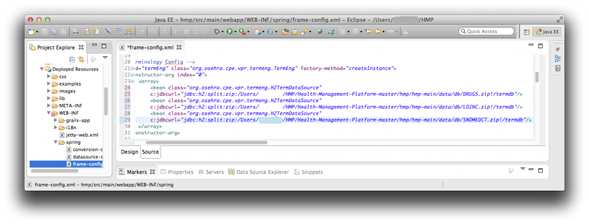

* Configure pom.xml

    * Find and open ``pom.xml``

	* In finder::

	    Health-Management-Platform/hmp/hmp-main/pom.xml

	* In my Eclipse Project Explorer::

	    hmp/pom.xml

    * Remove (or comment out) execution: copy-termdb-databases, lines 595-635

    * Save ``pom.xml``

* Update the project

    * In Eclipse, right click on the hmp project in the Project Explorer then
      select Maven > Update Project

9) Manually Update Maven Repository to Fill HMP Library
========================================================

* Configure Eclipse

    * In Eclipse, right click on the hmp project, select Properties > Maven

	* Make sure ``Resolve dependencies from workspace projects`` is not
          selected

* Install the vista-support jars

    * In terminal, execute the following commands::

	cd Health-Management-Platform/hmp/vista-support/
	mvn clean
	mvn package
	mvn install

* Install the health-time jars

    * In terminal, execute the following commands::

	cd Health-Management-Platform/hmp/health-time/
	mvn clean
	mvn package
	mvn install

* Install psi-probe

    * Download version 2.3.1_

    * Move downloaded probe folder to ``hmp-main`` directory

    * In terminal, execute the following commands::

	cd Health-Management-Platform/hmp/hmp-main/
	mvn install:install-file -Dfile=probe-2/probe.war -DgroupId=com.googlecode.psi-probe -DartifactId=probe -Dversion=2.3.1 -Dpackaging=war

10) Compile HMP
===============

* Compile the Health Management Platform package

    * In Terminal, execute the following commands::

	cd Health-Management-Platform/hmp/hmp-main/
	mvn clean
	mvn compile -DskipTests=true
	mvn package -DskipTests=true

11) Setting Up HMP
==================

* Enable SSL in Tomcat

    * Edit the following command::

	$JAVA_HOME/bin/keytool -genkey -alias tomcat -keyalg RSA

    * Replace JAVA_HOME with the path to Java on your machine

	* On my machine::

	    /System/Library/Frameworks/JavaVM.framework/Versions/CurrentJDK/Home/bin/keytool -genkey -alias tomcat -keyalg RSA

    * Execute the new command in Terminal

    * Enter keystore password of ``changeit``

* Edit ``$CATALINA_BASE/conf/server.xml``

    * Find and open the file ``$CATALINA_BASE/conf/server.xml``

	* On my machine::

	    Health-Management-Platform/hmp/hmp-main/target/apache-tomcat-7.0.29/conf/server.xml

    * Uncomment the ``SSL HTTP/1.1 Connector`` entry

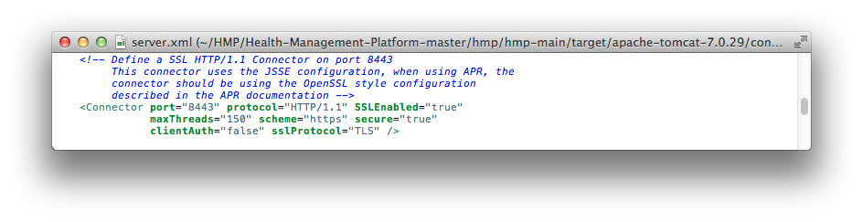

* Run HMP using Tomcat

    * In terminal::

	cd target/apache-tomcat-7.0.29/bin
	chmod +x *.sh
	export JAVA_OPTS="-Xms512m -Xmx1024m -XX:MaxPermSize=256m -Dsolr.solr.home=../../solr"
	mv ../webapps/ROOT ../webapps/ROOT-old && mv ../../hmp-0.7-P34 ../webapps/ROOT
	./startup.sh
	tail -f ../logs/catalina.out

* Locate and update the _extjs.gsp file

    * On my machine::

	Health-Management-Platform/hmp/hmp-main/target/apache-tomcat-7.0.29/webapps/ROOT/WEB-INF/grails-app/views/layouts/_extjs.gsp

    * On line 27, change both instances of ``gov`` to ``org``

    * On line 36, change ``org.osehra`` to ``org/osehra``

    * The file should look like this when complete:

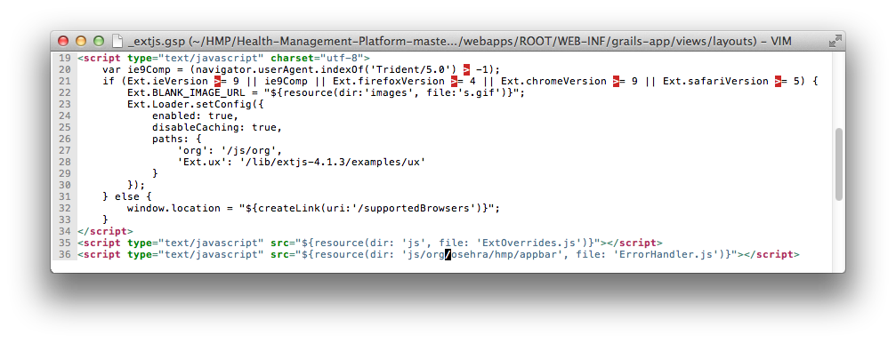

* Rerun HMP using Tomcat

    * In Terminal::

	Control+c
	./shutdown.sh && ./startup.sh && tail -f ../logs/catalina.out

* Set up HMP

    * Wait for Terminal to display::

	INFO: Server startup in # ms

    * Open a web-browser

    * Type into the URL bar::

	localhost:8080

    * You should be redirected to::

	https://localhost:8443/setup

    * Enter credentials::

	Station Number: Your Station Number
	Name: Name for the connection
	Host: hostname/fqdn/ip address
	Port: RPC Broker Port
	Access Code: Your access code (Needs to have access to the correct contexts)
	Verify Code: Your verify code

    * Click the Test Connection button, if the connection test is successful,
      click the Finish Confguration button

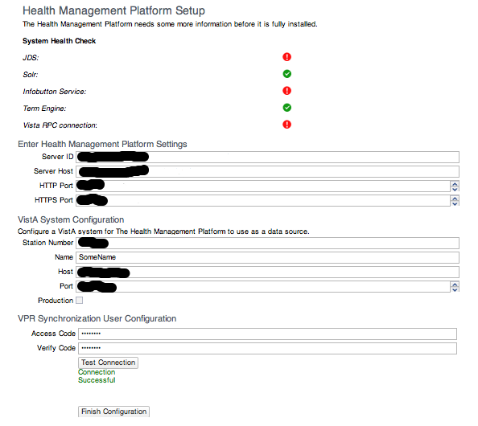

* Close the connection

    * In terminal, execute the following::

	Control+c
	./shutdown

* Update the new HMP Properties file

    * Open both versions of hmp.properties, on my machine::

	Health-Management-Platform/hmp/hmp-main/target/hmp.properties
	Health-Management-Platform/hmp/hmp-main/target/apache-tomcat-7.0.29/bin/hmp.properties

    * In the ``target/apache-tomcat-7.0.29/bin/hmp.properties`` file, comment
      out the ``hmp.properties.encrypted=true`` line by adding a ``#`` before
      the statement

    * Copy everything in the ``target/hmp.properties`` from
      ``hmp.rpc.log=true`` down and paste it into the
      ``target/apache-tomcat-7.0.29/bin/hmp.properties`` file

    * Your ``target/apache-tomcat-7.0.29/bin/hmp.properties`` file should look
      like this when complete:

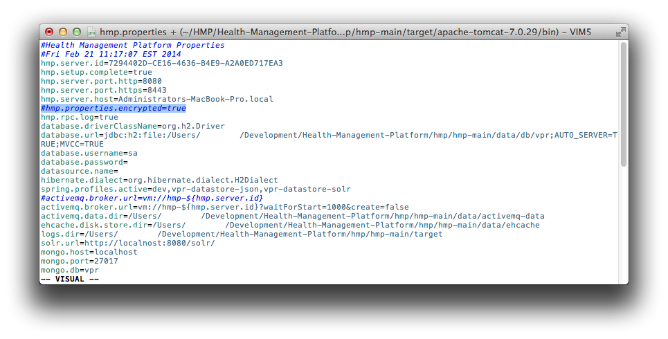

12) Running HMP
===============

* Start up HMP using Tomcat

    * In Terminal, execute the following::

	cd Health-Management-Platform/hmp/hmp-main/target/apache-tomcat-7.0.29/bin/
	./startup.sh && tail -f ../logs/catalina.out

* Sign in to HMP

    * Wait for Terminal to display::

	INFO: Server startup in # ms

    * Open a Web browser

    * Type into the URL bar::

	localhost:8080

    * You should be redirected to::

	https://localhost:8443/auth/login

    * Enter Credentials::

	Facility: Your connection name 
	Access Code: Your access code
	Verify Code: Your verify code

    * Click the Sign In button

.. image:: Images/YHMPsignin.png
    :align: center

* If your browser looks like this:

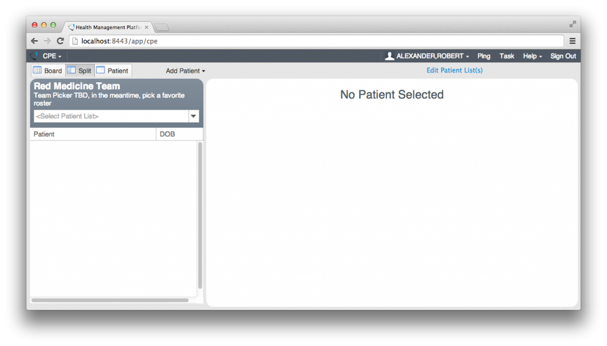

*********************************************************************************
**Congratulations! You have successfully loaded The Health Management Platform!**
*********************************************************************************

.. _GitHub: https://github.com/OSEHRA-Sandbox/Health-Management-Platform
.. _NLM: http://www.nlm.nih.gov/research/umls/licensedcontent/umlsarchives04.html
.. _Caché: http://www.intersystems.com/our-products/cache/cache-overview/
.. _Eclipse: https://www.eclipse.org/downloads/
.. _Maven: http://maven.apache.org/download.cgi
.. _PostgreSQL: http://www.enterprisedb.com/products-services-training/pgdownload
.. _jar: http://mvnrepository.com/artifact/postgresql/postgresql/9.1-901.jdbc4
.. _2.3.1: https://psi-probe.googlecode.com/files/probe-2.3.1.zip
